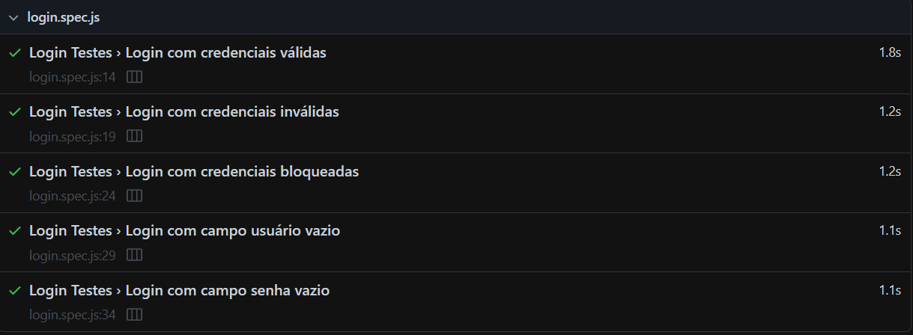
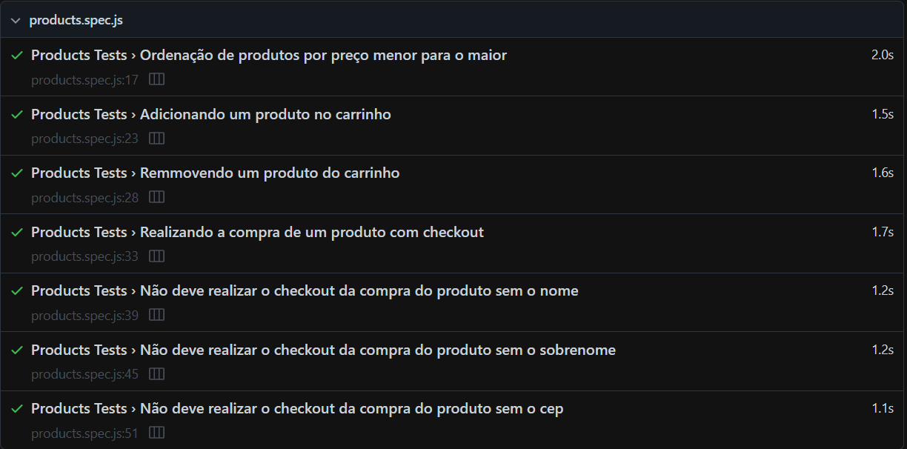

# Automação Saucedemo.playwright - Voidr.

Teste ténico com o foco em Automação end-to-end utilizando Playwright, POM para organização dos testes.

## Pré-requisitos

Este projeto utiliza das versões `v20.11.1`, `v10.8.1` e `1.49.0` do node, npm e playwright respectivamente. 

## Instalações

Execute o `npm install` ou `npm i` para instalar as dependências do projeto.
## Rodando os testes

Para rodar os testes, rode o seguinte comando

```bash
  npm test
```

Para rodar no modo GUI

```bash
  npm run ui:mode
```

## Stack utilizada

**Framework de Automação:** Playwright/JS

## Documentação

 - [Playwright](https://playwright.dev/)

## Autores

[santosvini](https://github.com/santosvini)

## Resultados



